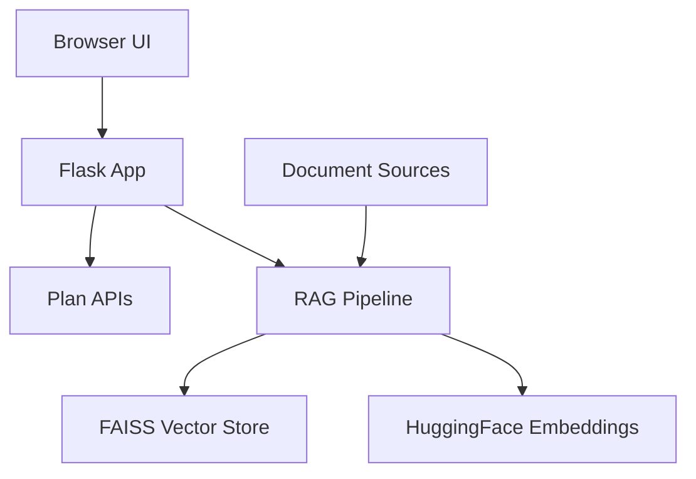

# Commission Dashboard Assistant (RAG) 🚀

[](https://www.python.org/downloads/)
[](https://flask.palletsprojects.com/)
[](https://opensource.org/licenses/MIT)
[](https://github.com/psf/black)

A production-ready intelligent assistant for creating commission plans and answering domain-specific questions using **Retrieval-Augmented Generation (RAG)**. Features a stateful, guided plan-creation workflow backed by REST APIs, plus a comprehensive document QA pipeline with multi-format support.

## ✨ Key Features

- **🎯 Guided Plan Creation**: Multi-phase wizard with session persistence
- **📚 RAG-Powered Q&A**: Query your local documents intelligently
- **📄 Multi-Format Support**: PDF, DOCX, Excel, CSV, TXT, JSON, and images (OCR)
- **🔍 Smart Document Processing**: FAISS vector store with Hugging Face embeddings
- **⚡ Performance Optimized**: Vector caching and one-click reset
- **🔧 Health Monitoring**: Connectivity diagnostics and detailed logging
- **🎨 Modern UI**: Clean, responsive web interface

## 🏗️ Architecture



## 🛠️ Tech Stack

| Category | Technologies |
|----------|-------------|
| **Backend** | Python 3.10+, Flask, Flask-Session |
| **AI/ML** | FAISS, Hugging Face Transformers, LangChain |
| **Document Processing** | PyPDF2, python-docx, pandas, pytesseract, Pillow |
| **Utilities** | requests, python-dotenv |

## 📁 Project Structure

```
commission-dashboard-assistant-RAG/
├── 📄 app.py                 # Main Flask application
├── 📄 rag.py                 # RAG pipeline implementation
├── 📄 requirements.txt       # Python dependencies
├── 📄 .env.example          # Environment variables template
├── 📁 templates/
│   └── 📄 index.html        # Web interface
├── 📁 data/                 # Document storage (gitignored)
│   ├── 📄 README.md
│   └── 📄 .gitkeep
├── 📁 model/                # Local ML models (gitignored)
│   ├── 📄 README.md
│   └── 📄 .gitkeep
├── 📁 docs/                 # Documentation assets
│   └── 📁 images/
└── 📄 README.md
```

## 🚀 Quick Start

### Prerequisites

- **Python 3.10+** (recommended)
- **Tesseract OCR** (for image processing)

### 1. Environment Setup

<details>
<summary><b>🐍 Virtual Environment</b></summary>

**macOS/Linux:**
```bash
python3 -m venv .venv
source .venv/bin/activate
```

**Windows:**
```cmd
python -m venv .venv
.venv\Scripts\activate
```
</details>

### 2. Installation

```bash
# Clone the repository
git clone https://github.com/SNEAKO7/commission-dashboard-assistant-RAG-.git
cd commission-dashboard-assistant-RAG-

# Install dependencies
pip install -r requirements.txt
```

### 3. Configuration

Create `.env` file:
```env
FLASK_SECRET_KEY=your-super-secure-secret-key-here
BACKEND_API_BASE_URL=https://localhost:8081
JWT_TOKEN=your-jwt-token-if-needed
DOCUMENTS_FOLDER=data
```

### 4. Document Setup

```bash
# Add your documents to the data folder
cp /path/to/your/documents/* data/
```

**Supported formats**: PDF, DOCX, TXT, JSON, Excel/CSV, Images (PNG, JPG, JPEG, TIFF)

### 5. Launch Application

```bash
python app.py
```

🌐 **Access at**: http://localhost:5000

## 📋 Tesseract OCR Installation

<details>
<summary><b>🪟 Windows</b></summary>

**Option 1 - Winget:**
```cmd
winget install -e --id UB-Mannheim.TesseractOCR
```

**Option 2 - Chocolatey:**
```cmd
choco install tesseract
```
</details>

<details>
<summary><b>🍎 macOS</b></summary>

```bash
brew install tesseract
```
</details>

<details>
<summary><b>🐧 Linux</b></summary>

**Ubuntu/Debian:**
```bash
sudo apt-get update && sudo apt-get install -y tesseract-ocr
```

**Fedora:**
```bash
sudo dnf install -y tesseract
```
</details>

## 🔌 API Endpoints

### Chat Interface
```http
POST /chat
Content-Type: application/json

{
    "message": "create a new commission plan",
    "user_id": "optional-stable-user-id"
}
```

### Health Check
```http
GET /_test_api
```
**Response:**
```json
{
    "api_base_url": "https://localhost:8081",
    "test_endpoint_status": 200,
    "jwt_present": true,
    "test_response": "OK"
}
```

### Cache Management
```http
POST /_clear_cache
```

## 📊 Plan Creation Workflow

### Phase 1: Plan Metadata
- Plan Name & Description
- Calculation & Payment Schedules
- Assignee Configuration
- Object Type Selection
- Validity Period (YYYY-MM-DD format)

### Phase 2: Business Rules
- Plan Type & Parameters
- Category Type (Flat/Slab/Tiered)
- Range & Value Types
- Base Value Configuration
- Rule Validity Dates
- Advanced Options (Absolute Calculation, Conditions, Steps)

### Phase 3: Assignments
- Parameter Combinations
- Tier Definitions (from, to, commission)
- Currency & UOM Selection
- Final Submission

## 💾 Sample API Payload

<details>
<summary><b>📋 Expand to view complete payload structure</b></summary>

```json
{
  "id": 0,
  "OrgCode": "",
  "PaymentSchedule": 12,
  "ProgramName": "Q3 Sales Incentives",
  "CalculationSchedule": 34,
  "ValidFrom": "2025-07-01T00:00:00",
  "ValidTo": "2025-09-30T23:59:59",
  "ReviewedBy": "",
  "ReviewStatus": "",
  "ObjectType": "Invoices",
  "TableId": 99,
  "AssigneeId": 456,
  "TableName": "hierarchy_master_instance",
  "AssigneeName": "North Region",
  "PlanConditionsDto": [
    {
      "PlanType": "Revenue Target",
      "PlanTypeMasterId": 7,
      "Sequence": 100,
      "Step": 0,
      "PlanDescription": "Revenue-based commission structure",
      "PlanParamsJson": "[\"territory\",\"product\"]",
      "Tiered": true,
      "CategoryType": "Tiered",
      "RangeType": "Amount",
      "ValueType": "Percentage",
      "ValidFrom": "2025-07-01",
      "ValidTo": "2025-09-30",
      "PlanBase": "Revenue",
      "BaseValue": "Gross",
      "JsonData": [
        {
          "commission": "",
          "tiers": [
            {
              "from_value": "0",
              "to_value": "100000", 
              "commission": "5"
            }
          ],
          "PlanValueRangesDto": [
            {
              "BusinessPartner": [],
              "Product": [311],
              "Territory": [],
              "Plant": [],
              "Group": []
            }
          ],
          "currency": 78
        }
      ],
      "ShowAssignment": true,
      "isStep": false,
      "AbsoluteCalculation": false
    }
  ],
  "CalculationScheduleLabel": "Monthly",
  "PaymentScheduleLabel": "Monthly"
}
```
</details>

## 🤖 RAG Usage Examples

```bash
# Example queries after adding documents to data/
curl -X POST http://localhost:5000/chat \
  -H "Content-Type: application/json" \
  -d '{"message": "What are the Q2 commission rates for the North Region?"}'

curl -X POST http://localhost:5000/chat \
  -H "Content-Type: application/json" \
  -d '{"message": "Summarize the latest policy changes"}'
```

## 🔧 Troubleshooting

| Issue | Solution |
|-------|----------|
| **API Errors (401/404/500)** | Verify `BACKEND_API_BASE_URL` and `JWT_TOKEN` in `.env` |
| **No RAG Results** | Ensure documents exist in `data/` folder; try clearing cache |
| **OCR Issues** | Verify Tesseract installation and PATH configuration |
| **FAISS Problems** | Use pinned `faiss-cpu` version; check platform compatibility |

## ⚡ Performance Optimization

- **Chunking**: 800 characters with 100 overlap (adjustable per corpus)
- **Large Datasets**: Consider persistent vector databases (Milvus/Chroma)
- **Better Recall**: Upgrade to stronger embedding models
- **Caching**: Leverage vector store caching for repeated queries

## 🗺️ Roadmap

- [ ] **Authentication & Authorization** - User roles and permissions
- [ ] **Streaming Responses** - Real-time UI updates
- [ ] **Containerization** - Docker support and CI/CD
- [ ] **Vector Store Options** - Pluggable backends
- [ ] **Enhanced UI** - Rich editing for rules and assignments
- [ ] **Background Processing** - Async document ingestion

## 📸 Screenshots

| Feature | Preview |
|---------|---------|
| **Dashboard** |  |
| **Plan Wizard** |  |
| **RAG Q&A** |  |

## 🤝 Contributing

1. Fork the repository
2. Create a feature branch (`git checkout -b feature/amazing-feature`)
3. Commit your changes (`git commit -m 'Add amazing feature'`)
4. Push to the branch (`git push origin feature/amazing-feature`)
5. Open a Pull Request

## 📄 License

This project is licensed under the MIT License - see the [LICENSE](LICENSE) file for details.

## 🙏 Acknowledgments

- **[FAISS](https://github.com/facebookresearch/faiss)** - Efficient similarity search
- **[Hugging Face](https://huggingface.co/)** - Transformer models and embeddings
- **[LangChain](https://langchain.com/)** - LLM application framework
- **[Flask](https://flask.palletsprojects.com/)** - Web framework
- The broader Python open-source community

---

<div align="center">
  <p>Built with ❤️ for intelligent commission management</p>
  <p>
    <a href="#commission-dashboard-assistant-rag-">⬆ Back to Top</a>
  </p>
</div>
