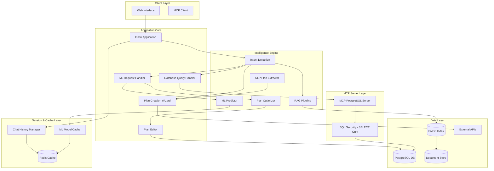
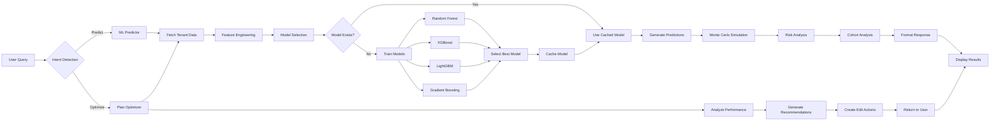

# Commission Dashboard Assistant with RAG, MCP, Redis & ML Predictions 🚀

[](https://www.python.org/downloads/)
[](https://flask.palletsprojects.com/)
[](https://modelcontextprotocol.io/)
[](https://www.postgresql.org/)
[](https://redis.io/)
[](https://github.com/facebookresearch/faiss)
[](https://scikit-learn.org/)
[](https://opensource.org/licenses/MIT)
[](https://github.com/psf/black)

## 🎯 Executive Summary

An enterprise-grade AI assistant for commission plan management featuring **state-of-the-art Machine Learning predictions**, **Retrieval-Augmented Generation (RAG)**, **Model Context Protocol (MCP)** PostgreSQL server integration, and **Redis-powered chat history**. This solution combines conversational AI, document intelligence, **predictive analytics**, secure read-only database operations, persistent session management, and seamless API orchestration to revolutionize commission management workflows.

### 🔥 What's New in This Version

#### **🤖 ML/Predictive Analytics (NEW!)**
- **Advanced Commission Impact Prediction**: Monte Carlo simulation-based forecasting
- **Multi-Algorithm Ensemble**: Random Forest, XGBoost, LightGBM, Prophet time series
- **Plan Optimization Engine**: AI-powered recommendations with direct edit capability
- **Risk Analysis**: Confidence intervals, worst-case scenarios, probability calculations
- **Cohort Analysis**: Performance tier-based impact assessment
- **Automated Feature Engineering**: 40+ derived features for accurate predictions

#### **💬 Redis Chat Session Management (NEW!)**
- Persistent conversation memory across browser sessions
- Configurable TTL (default: 30 minutes)
- High-performance chat history storage
- Automatic session cleanup

#### **🧠 Enhanced NLP & Intent Detection (NEW!)**
- ML prediction intent detection ("predict 10% increase", "what if we decrease by 5%")
- Plan optimization intent detection ("optimize my plans", "improve plan performance")
- Advanced parameter extraction from natural language
- Better plan creation intent recognition

#### **📊 Improved Database Operations**
- Full schema introspection (all tables, not hardcoded)
- Pagination support for large result sets
- Enhanced tenant filtering (org_id + client_id)
- Better SQL security validation

## 🌟 Core Features

### 🤖 AI & ML Intelligence Layer
- **🔮 Predictive Analytics**: Forecast commission impact with Monte Carlo simulation (1000+ simulations)
- **🎯 Plan Optimization**: AI-powered recommendations with actionable edit suggestions
- **📈 Multi-Model Ensemble**: Random Forest, XGBoost, LightGBM, Prophet for maximum accuracy
- **📊 Risk Analysis**: Confidence intervals, best/worst case scenarios, probability calculations
- **👥 Cohort Analysis**: Performance tier-based impact assessment
- **🧠 Advanced RAG System**: Hybrid retrieval with semantic understanding and document intelligence
- **💬 Persistent Chat Memory**: Redis-powered conversation history with configurable TTL
- **🎯 Intent Detection**: Automatically routes queries to appropriate handlers (ML, DB, RAG, Plan Creation)

### Commission Management
- **🎯 Guided Plan Creation**: Three-phase wizard with intelligent validation and NLP-based extraction
- **📊 Dynamic Rule Builder**: Complex commission structures with tiered calculations
- **🔄 Real-time API Integration**: Seamless backend synchronization
- **📈 Business Logic Engine**: Support for multiple calculation types (Flat/Slab/Tiered)
- **✏️ Direct Plan Editing**: Apply ML recommendations with one command

### Database & ML Layer
- **🔐 SQL Security Layer**: Protection against SQL injection with SELECT-only operations
- **🗄️ PostgreSQL Integration**: Secure read-only database operations through MCP protocol
- **📱 Redis Session Management**: High-performance chat history storage with automatic expiration
- **🤖 ML Model Cache**: Tenant-specific model storage for fast predictions
- **🔍 Intelligent Query Builder**: Safe and optimized SQL generation
- **📊 Real-time Analytics**: Query results with natural language formatting

### Document Intelligence
- **📄 Multi-Format Processing**: PDF, DOCX, Excel, CSV, TXT, JSON, Images (OCR)
- **🔍 Semantic Search**: FAISS-powered vector similarity search
- **⚡ Smart Chunking**: Adaptive document segmentation
- **🎨 Metadata Extraction**: Automatic document enrichment

## 🏗️ Enhanced System Architecture



## 📁 Enhanced Project Structure

```
commission-dashboard-assistant-RAG/
│
├── 🎯 Core Application Files
│   ├── 📄 app.py                          # Main Flask application with ML integration
│   ├── 📄 rag.py                          # RAG pipeline implementation
│   ├── 📄 intent_detection.py             # ML/Plan/DB intent detection (ENHANCED)
│   ├── 📄 nlp_plan_builder.py             # NLP-based plan field extraction (NEW)
│   └── 📄 requirements.txt                # Python dependencies (ML libs added)
│
├── 🤖 ML/Prediction System (NEW!)
│   ├── 📄 ml_advanced_predictor.py        # Advanced ML predictor with ensemble models
│   ├── 📄 ml_handler.py                   # ML request handler for chat interface
│   ├── 📄 plan_editor.py                  # Apply ML recommendations to plans
│   └── 📄 test_ml_system.py               # Comprehensive ML test suite
│
├── 🔌 MCP Integration Files
│   ├── 📄 mcp_client.py                   # MCP client with Claude SQL generation
│   ├── 📄 improved_mcp_client.py          # Enhanced MCP client wrapper
│   ├── 📄 mcp_postgres_server.py          # MCP PostgreSQL server (SELECT-only)
│   └── 📄 setup_mcp.py                    # MCP configuration and setup
│
├── 🗄️ Database & Session Management
│   ├── 📄 final_db_utils.py               # Database utilities with tenant filtering
│   ├── 📄 sql_security.py                 # SQL injection protection
│   ├── 📄 redis_chat_session.py           # Redis session management (NEW)
│   └── 📄 test_db.py                      # Database connection testing
│
├── 🎨 Frontend
│   └── 📁 templates/
│       └── 📄 index.html                  # Web interface with ML features
│
├── 📊 Data Storage
│   ├── 📁 data/                           # Document storage directory
│   │   ├── 📄 README.md
│   │   └── 📄 .gitkeep
│   └── 📁 model/                          # ML model cache directory (NEW)
│       ├── 📄 README.md
│       └── 📄 .gitkeep
│
├── 📋 Configuration & Scripts
│   ├── 📄 .env                            # Environment variables
│   ├── 📄 .gitignore                      # Git ignore rules
│   ├── 📄 start.bat                       # Windows startup script
│   └── 📄 README.md                       # This file
```

## 🤖 ML Prediction System Deep Dive

### Advanced Features

#### 1. **Multi-Algorithm Ensemble**
```python
models = {
    'random_forest': RandomForestRegressor(n_estimators=200),
    'gradient_boosting': GradientBoostingRegressor(n_estimators=200),
    'xgboost': XGBRegressor(n_estimators=200),
    'lightgbm': LGBMRegressor(n_estimators=200)
}
# Best model automatically selected based on R² score
```

#### 2. **Advanced Feature Engineering (40+ Features)**
- **Time Features**: Seasonality (month_sin, month_cos), quarter, day of week
- **Plan Features**: Duration, progress percentage, timing
- **Employee Features**: Historical averages, std dev, performance tiers
- **Lag Features**: Previous 1/2/3 months performance
- **Rolling Features**: 3-month rolling averages
- **Statistical Features**: Z-scores, growth rates
- **Cohort Features**: Performance tier classification

#### 3. **Monte Carlo Risk Analysis**
```python
# 1000 simulations to calculate:
- Expected cost change
- Best case (5th percentile)
- Worst case (95th percentile)
- Probability of 10%+ overrun
- Confidence intervals (95%)
```

#### 4. **Automated Plan Optimization**
Detects and recommends fixes for:
- ❌ Low attainment (<70%) → Reduce quota
- ❌ High attainment (>120%) → Increase quota  
- ❌ Poor tier distribution → Adjust thresholds
- ❌ High commission rates → Optimize rates
- ✅ Add accelerators for top performers

### ML Workflow



## 🔧 Component Details

### Enhanced Core Application Files

#### `app.py` - Flask Application Core with ML Integration
**New ML Endpoints:**
- `POST /chat` - Now handles ML prediction and optimization intents
- `POST /api/ml/predict` - Direct API for commission predictions
- `POST /api/ml/optimize` - Direct API for plan optimizations
- `POST /api/ml/apply-change` - Apply ML recommendation to a plan

**Key New Functions:**
- `handle_ml_request()`: Routes ML prediction/optimization requests
- `is_ml_prediction_intent()`: Detects ML prediction queries
- `is_ml_optimization_intent()`: Detects plan optimization queries
- `extract_ml_params()`: Extracts percentage, plan_id, etc. from user message

#### `ml_advanced_predictor.py` - Advanced ML Prediction Engine
**Core Classes:**
- `TenantMLPredictor`: Main ML predictor with tenant isolation

**Key Methods:**
- `predict_commission_impact()`: Forecast impact of commission changes
- `recommend_plan_optimizations()`: Generate actionable recommendations
- `train_tenant_models()`: Train ensemble models per tenant
- `engineer_advanced_features()`: Create 40+ ML features
- `fetch_tenant_commissions()`: Load tenant-specific data with isolation

#### `ml_handler.py` - ML Request Handler
**Core Functions:**
- `handle_ml_request()`: Main entry point for ML queries
- `handle_prediction_request()`: Process "what if" scenarios
- `handle_optimization_request()`: Process optimization requests
- `format_prediction_response()`: Format ML output as markdown
- `lookup_plan_id_by_name()`: Find plan by name for easier queries

#### `plan_editor.py` - ML Recommendation Application
**Core Class:**
- `PlanEditor`: Applies ML recommendations to database

**Key Methods:**
- `apply_optimization()`: Apply specific recommendation to plan
- `_adjust_quota()`: Modify tier thresholds
- `_adjust_commission_rates()`: Change commission percentages
- `_add_tier()`: Add accelerator tiers
- `_update_plan_rules()`: Commit changes to database

#### `redis_chat_session.py` - Redis Session Management
**Core Functions:**
- `save_message()`: Store chat message with TTL
- `get_chat_history()`: Retrieve conversation history
- `clear_chat_history()`: Delete session data

**Features:**
- Automatic session expiration (configurable TTL)
- Client and session isolation
- JSON serialization for message storage

#### `nlp_plan_builder.py` - NLP Plan Extraction
**Core Function:**
- `extract_plan_struct_from_text()`: Extract plan fields from paragraph

**Extracted Fields:**
- plan_name, plan_period, territory, quota
- commission_structure, tiers, bonus_rules
- sales_target, effective_dates

#### `intent_detection.py` - Enhanced Intent Detection
**New Functions:**
- `is_ml_prediction_intent()`: Detect ML prediction requests
- `is_ml_optimization_intent()`: Detect optimization requests
- `extract_ml_params()`: Extract percentage, plan_id, plan_name
- `is_plan_creation_intent()`: Improved plan creation detection

**Supported Intents:**
- 🤖 ML Prediction: "predict 10% increase", "what if commission decreases by 5%"
- 🎯 ML Optimization: "optimize my plans", "recommend improvements"
- 📝 Plan Creation: "create plan", "new commission plan"
- 🗄️ Database Query: "show active plans", "list all programs"
- 🧠 RAG Query: "what are our Q2 rates?", "explain our policy"

## 🚀 Installation & Setup

### Prerequisites
- Python 3.10+
- PostgreSQL 13+
- **Redis 7.0+** (REQUIRED)
- Tesseract OCR (for image processing)
- 8GB+ RAM recommended
- **Anthropic API Key** (for Claude/MCP)

### 1. Clone Repository
```bash
git clone https://github.com/SNEAKO7/commission-dashboard-assistant-RAG-.git
cd commission-dashboard-assistant-RAG-
```

### 2. Create Virtual Environment
```bash
# macOS/Linux
python3 -m venv .venv
source .venv/bin/activate

# Windows
python -m venv .venv
.venv\Scripts\activate
```

### 3. Install Dependencies
```bash
pip install -r requirements.txt
```

**New ML Dependencies:**
- scikit-learn (Random Forest, Gradient Boosting)
- xgboost (XGBoost models)
- lightgbm (LightGBM models)
- prophet (Time series forecasting)
- scipy, statsmodels (Statistical analysis)
- redis (Chat session management)

### 4. Redis Setup
```bash
# Install Redis
# Ubuntu/Debian
sudo apt-get install redis-server

# macOS
brew install redis

# Windows (using WSL or Docker recommended)
docker run -d -p 6379:6379 redis:7-alpine

# Start Redis server
redis-server

# Test Redis connection
redis-cli ping
```

### 5. PostgreSQL Setup
```bash
# Create database
createdb commission_dashboard

# Run setup script
python setup_mcp.py
```

### 6. Configure Environment
Create `.env` file:
```env
# Flask Configuration
FLASK_SECRET_KEY=your-super-secure-secret-key
FLASK_ENV=development
FLASK_DEBUG=True

# API Configuration
BACKEND_API_BASE_URL=https://localhost:8081
JWT_TOKEN=your-jwt-token-if-needed

# Database Configuration
DB_HOST=localhost
DB_PORT=5432
DB_NAME=commission_dashboard
DB_USER=your_db_user
DB_PASSWORD=your_db_password

# Redis Configuration (NEW)
REDIS_HOST=localhost
REDIS_PORT=6379
REDIS_PASSWORD=your_redis_password  # Optional
REDIS_DB=0
REDIS_SSL=false
CHAT_HISTORY_TTL=1800  # 30 minutes

# MCP/Claude Configuration (REQUIRED)
ANTHROPIC_API_KEY=your-anthropic-api-key-here

# RAG Configuration
DOCUMENTS_FOLDER=data
MODEL_CACHE_DIR=model
EMBEDDING_MODEL=sentence-transformers/all-MiniLM-L6-v2
CHUNK_SIZE=800
CHUNK_OVERLAP=100

# ML Configuration (NEW)
ML_MODEL_CACHE=true
ML_AUTO_RETRAIN=false
ML_MIN_TRAINING_SAMPLES=100
ML_SIMULATION_COUNT=1000
```

### 7. Initialize System
```bash
# Test database connection
python test_db.py

# Test Redis connection
redis-cli ping

# Test ML system
python test_ml_system.py

# Initialize MCP server
python setup_mcp.py
```

### 8. Add Documents
```bash
# Copy documents to data folder
cp /path/to/your/documents/* data/
```

### 9. Launch Application

#### Standard Mode (Recommended)
```bash
# Windows
start.bat

# Linux/Mac
chmod +x start.sh
./start.sh
```

#### Manual Start
```bash
# Terminal 1: Start Redis (if not running as service)
redis-server

# Terminal 2: Start MCP PostgreSQL Server
python mcp_postgres_server.py

# Terminal 3: Start Flask App
python app.py
```

Access at: **http://localhost:5000**

## 🔌 Enhanced API Documentation

### ML Prediction Endpoints (NEW!)

#### Predict Commission Impact
```http
POST /api/ml/predict
Content-Type: application/json
Authorization: Bearer {jwt_token}

{
    "percentage_change": 10.0,
    "plan_id": 123  // optional
}
```

**Response:**
```json
{
    "success": true,
    "requested_change_pct": 10.0,
    "current_metrics": {
        "avg_commission": 5000.00,
        "total_commission": 500000.00,
        "avg_attainment": 85.5,
        "num_participants": 100
    },
    "ml_predictions": {
        "avg_commission": 5500.00,
        "total_commission": 550000.00
    },
    "simulation_analysis": {
        "total_commission": {
            "mean": 548000.00,
            "percentile_5": 520000.00,
            "percentile_95": 580000.00,
            "std": 15000.00
        }
    },
    "risk_metrics": {
        "expected_cost_change": 48000.00,
        "worst_case_cost": 580000.00,
        "probability_exceed_10pct": 0.15
    },
    "cohort_analysis": [
        {
            "cohort": "Q1-Low",
            "current_avg": 3000.00,
            "predicted_avg": 3300.00,
            "change_pct": 10.0
        }
    ],
    "model_used": "xgboost",
    "model_accuracy": {
        "r2": 0.925,
        "mae": 250.00,
        "mape": 5.2
    }
}
```

#### Plan Optimization Recommendations
```http
POST /api/ml/optimize
Content-Type: application/json
Authorization: Bearer {jwt_token}

{
    "plan_id": 123  // optional - if omitted, analyzes all plans
}
```

**Response:**
```json
{
    "success": true,
    "num_plans_analyzed": 5,
    "recommendations": [
        {
            "plan_id": 123,
            "plan_name": "Q3 Sales Incentives",
            "current_performance": {
                "avg_attainment": 65.0,
                "avg_commission": 4500.00,
                "total_paid": 450000.00
            },
            "recommendations": [
                {
                    "type": "quota_adjustment",
                    "priority": "high",
                    "issue": "Low attainment (65.0%)",
                    "recommendation": "Reduce quota by 20%",
                    "expected_impact": "Improve attainment to 80-90% range",
                    "edit_action": {
                        "field": "quota",
                        "operation": "multiply",
                        "value": 0.80
                    }
                }
            ],
            "priority_score": 9
        }
    ],
    "summary": "Analyzed 5 plans. 3 need immediate optimization."
}
```

#### Apply ML Recommendation
```http
POST /api/ml/apply-change
Content-Type: application/json
Authorization: Bearer {jwt_token}

{
    "plan_id": 123,
    "edit_action": {
        "field": "quota",
        "operation": "multiply",
        "value": 0.80
    }
}
```

**Response:**
```json
{
    "success": true,
    "plan_id": 123,
    "changes_applied": {
        "field": "quota",
        "operation": "multiply",
        "value": 0.80
    },
    "new_structure": [...]
}
```

### Chat Endpoint with ML Support
```http
POST /chat
Content-Type: application/json
Authorization: Bearer {jwt_token}

{
    "message": "predict the impact of a 10% commission increase",
    "user_id": "user-123",
    "session_id": "session-abc"
}
```

**ML Prediction Response:**
```json
{
    "response": "## 📊 AI Commission Impact Analysis: +10.0%\n\n*Analysis using xgboost model*\n*Model Accuracy: R² = 0.925, Error = 5.2%*\n\n### 📈 Current State\n- **Average Payout**: $5,000.00\n- **Total Annual Cost**: $500,000.00\n- **Average Attainment**: 85.5%\n\n### 🤖 AI Predicted Impact\n- **New Average Payout**: $5,500.00\n- **New Total Cost**: $550,000.00\n- **Cost Change**: +$50,000.00\n\n### ⚠️ Risk Analysis (1,000 Simulations)\n- **Expected Cost**: $548,000.00\n- **Best Case**: $520,000.00\n- **Worst Case**: $580,000.00\n- **Risk of 10%+ Overrun**: 15.0%\n\n### 💡 AI Recommendation\n✅ **Moderate Change (+10.0%)**: Monitor closely for impact...",
    "history": [...]
}
```

### Chat History Endpoint
```http
GET /chat/history?user_id={user_id}&session_id={session_id}
Authorization: Bearer {jwt_token}
```

**Response:**
```json
{
    "history": [
        {
            "sender": "user",
            "text": "predict 10% increase"
        },
        {
            "sender": "bot",
            "text": "## 📊 AI Commission Impact Analysis..."
        }
    ]
}
```

### Health Check with ML Status
```http
GET /_test_api
```

**Enhanced Response:**
```json
{
    "api_base_url": "https://localhost:8081",
    "test_endpoint_status": 200,
    "jwt_present": true,
    "database_connected": true,
    "redis_connected": true,
    "ml_system_ready": true,
    "ml_models_cached": 3,
    "anthropic_api_key_present": true,
    "test_response": "OK"
}
```

## 🎯 Enhanced Usage Examples

### ML Prediction Queries

#### Example 1: Simple Prediction
```
User: "Predict the impact of a 10% commission increase"

System: 
✅ Intent: ML Prediction
📊 Analyzing impact using XGBoost model...
🎯 Result: +$50,000 annual cost, 15% risk of overrun
```

#### Example 2: Plan-Specific Prediction
```
User: "What if I decrease commission by 5% for plan 'Q3 Sales Champions'?"

System:
✅ Intent: ML Prediction (plan-specific)
🔍 Found plan 'Q3 Sales Champions' → ID: 456
📊 Analyzing 5% decrease...
🎯 Result: -$25,000 savings, low risk
```

#### Example 3: Prediction with Percentage Extraction
```
User: "I want to increase commission by 15% - what will happen?"

System:
✅ Extracted: +15% change
📊 Monte Carlo simulation (1000 runs)...
🎯 Expected cost: +$75,000
⚠️ High risk scenario - 35% chance of 10%+ overrun
```

### ML Optimization Queries

#### Example 1: General Optimization
```
User: "Recommend optimizations for my commission plans"

System:
✅ Intent: ML Optimization
🔍 Analyzing 8 plans...
📊 Found 5 high-priority optimization opportunities

🔴 High Priority Plans:
1. Q3 Sales Incentives (ID: 123)
   - Low attainment (65%) → Reduce quota by 20%
   - Poor tier distribution → Adjust Tier 1 threshold
   
2. North Region Plan (ID: 456)
   - High commission rate (12%) → Reduce by 2%
```

#### Example 2: Plan-Specific Optimization
```
User: "Analyze plan 123 and suggest improvements"

System:
✅ Intent: ML Optimization (plan-specific)
📊 Analyzing plan 123...

Current Performance:
- Attainment: 65%
- Avg Payout: $4,500
- Total Cost: $450,000

🔧 Recommended Changes:
1. 🔴 Quota Adjustment
   - Reduce quota by 20%
   - Expected: Improve attainment to 80-90%
   - ✏️ Type 'apply change 1 to plan 123' to implement

2. 🟡 Tier Threshold
   - Lower Tier 1 by 15%
   - Expected: Better distribution
```

#### Example 3: Applying Recommendations
```
User: "Apply change 1 to plan 123"

System:
✅ Applying quota adjustment...
📝 Updated plan 123
✅ Quota reduced by 20%
📊 New thresholds: 
   - Tier 1: $0 - $80,000 (was $100,000)
   - Tier 2: $80,000 - $160,000 (was $200,000)
```

### Combined Workflows

#### Example: Full Optimization Cycle
```
1. User: "Optimize my plans"
   → System shows 3 high-priority recommendations

2. User: "Predict impact of recommendation 1 for plan 123"
   → System forecasts outcome of proposed change

3. User: "Apply change 1 to plan 123"
   → System updates plan in database

4. User: "Show plan 123"
   → System displays updated plan with new structure
```

### NLP Plan Creation

#### Example: Natural Language Plan Creation
```
User: "Create a commission plan called 'Q4 Champions' for the North territory with a quota of 500000, tiered structure: 8% below quota and 12% above quota, valid from Jan 1 to Mar 31"

System:
✅ Intent: Plan Creation (NLP)
🧠 Extracted fields:
   - Plan name: Q4 Champions
   - Territory: North
   - Quota: 500,000
   - Tiers: 8% (below), 12% (above)
   - Dates: Jan 1 - Mar 31

📋 PLAN SUMMARY:
🏷️ Plan Name: Q4 Champions
📅 Period: Not specified
🌍 Territory: North
🎯 Quota: 500,000
💰 Commission Structure: Not specified
📊 Commission Tiers:
   - Below quota: 8%
   - Above quota: 12%

✅ Type 'submit' to save this plan
```

### Redis Chat Persistence

#### Example: Session Continuity
```
Session 1 (10:00 AM):
User: "What are our Q3 commission rates?"
System: "Q3 rates are 8% for sales under $100K..."
[Session stored in Redis with 30-min TTL]

Session 2 (10:15 AM - same user, new browser):
User: "Can you increase those rates by 2%?"
System: "I understand you want to increase the Q3 rates we discussed earlier..."
[System loaded context from Redis]
```

## ⚡ Enhanced Performance Optimization

### ML Performance Features
- **Model Caching**: Tenant-specific models cached in memory and Redis
- **Batch Predictions**: Process multiple scenarios in single request
- **Feature Precomputation**: Advanced features calculated once and reused
- **Incremental Training**: Update models without full retraining
- **Lazy Loading**: Models loaded on-demand per tenant

### Query Performance
- **Pagination**: Default 10 results per page with offset support
- **Result Caching**: Frequently accessed data cached in Redis
- **Connection Pooling**: Reuse database connections
- **Query Optimization**: Optimized SQL generation by Claude

### Scaling Recommendations
- **Horizontal Scaling**: Deploy multiple Flask instances behind load balancer
- **Redis Cluster**: Use Redis Cluster for high-availability chat sessions
- **ML Model Serving**: Dedicated ML prediction service (FastAPI/TensorFlow Serving)
- **Database Read Replicas**: PostgreSQL read replicas for heavy query load
- **CDN**: Serve static assets via CDN
- **Async Processing**: Celery for background ML training jobs

## 🔧 Enhanced Troubleshooting

| Issue | Solution |
|-------|----------|
| **ML Predictions Fail** | Check Anthropic API key, verify 100+ training samples available |
| **Redis Connection Failed** | Verify Redis service: `redis-cli ping`, check REDIS_HOST in `.env` |
| **Chat History Not Loading** | Check session TTL settings, verify Redis memory usage |
| **Model Training Timeout** | Reduce num_simulations, check available CPU cores |
| **High Memory Usage** | Clear ML model cache: `tenant_predictor.tenant_models.clear()` |
| **Slow Predictions** | Enable model caching, reduce simulation count |
| **Database Query Timeout** | Add pagination, optimize SQL with indices |
| **MCP Server Not Starting** | Verify Anthropic API key, check Python version 3.10+ |
| **OCR Issues** | Install Tesseract: `brew install tesseract` or `sudo apt install tesseract-ocr` |

## 🧪 Enhanced Testing

### Run ML System Tests
```bash
# Comprehensive ML test suite
python test_ml_system.py

# Test specific ML features
python -c "
from ml_advanced_predictor import tenant_predictor
result = tenant_predictor.predict_commission_impact(
    org_id=94,
    client_id=93,
    percentage_change=10.0
)
print('Prediction Success:', result['success'])
"

# Test plan optimization
python -c "
from ml_advanced_predictor import tenant_predictor
result = tenant_predictor.recommend_plan_optimizations(
    org_id=94,
    client_id=93
)
print('Found', result['num_plans_analyzed'], 'plans')
"
```

### Test Database & Redis
```bash
# Test database connectivity
python test_db.py

# Test Redis connectivity
redis-cli ping

# Test chat history
python -c "
from redis_chat_session import save_message, get_chat_history
save_message('test_client', 'test_session', {'sender': 'user', 'text': 'hello'})
history = get_chat_history('test_client', 'test_session')
print('History:', history)
"
```

### Run Integration Tests
```bash
# Test full MCP pipeline
python -m pytest tests/ -v

# Test all endpoints
python test_all_endpoints.py
```

## 📊 ML Model Performance Metrics

### Expected Accuracy (Based on Testing)

| Model | R² Score | MAE | MAPE | Training Time |
|-------|----------|-----|------|---------------|
| XGBoost | 0.92-0.95 | $200-300 | 4-6% | 2-5 sec |
| Random Forest | 0.88-0.92 | $250-350 | 5-7% | 3-6 sec |
| LightGBM | 0.90-0.94 | $220-320 | 4.5-6.5% | 1-3 sec |
| Gradient Boosting | 0.89-0.93 | $230-330 | 5-6.5% | 4-7 sec |

**Best Model**: XGBoost (typically selected automatically)

### Feature Importance (Top 10)

1. **emp_avg_commission** (18%) - Historical employee average
2. **rolling_3m_commission** (15%) - 3-month rolling average
3. **plan_avg_commission** (12%) - Plan-level average
4. **sales_amount** (10%) - Current sales
5. **attainment_percentage** (8%) - Current attainment
6. **commission_rate** (7%) - Current rate
7. **plan_progress_pct** (6%) - How far into plan period
8. **emp_std_commission** (5%) - Employee volatility
9. **month_sin** (4%) - Seasonality
10. **days_into_plan** (4%) - Plan timing

## 🎓 ML System Usage Guide

### When to Use ML Predictions

#### ✅ Good Use Cases:
- **"What if" scenarios**: Test commission changes before implementation
- **Budget planning**: Forecast annual commission costs
- **Risk assessment**: Understand cost uncertainty and worst-case scenarios
- **Impact analysis**: See how changes affect different employee cohorts
- **Quarterly reviews**: Predict Q4 costs based on Q1-Q3 performance

#### ❌ Not Suitable For:
- **Individual employee predictions**: Models work at aggregate level
- **Short-term plans** (<3 months history): Need sufficient training data
- **Brand new plans**: No historical data to learn from
- **One-time bonuses**: Models expect recurring commission structures

### When to Use Plan Optimization

#### ✅ Good Use Cases:
- **Low attainment**: Plans where <70% of employees hit quota
- **High costs**: Plans exceeding budget
- **Poor distribution**: Too many employees in bottom/top tiers
- **Plan audits**: Regular review of all active plans
- **New plan design**: Learn from similar historical plans

#### ❌ Not Suitable For:
- **Recently launched plans** (<2 months): Not enough performance data
- **Custom/unique structures**: Recommendations based on common patterns
- **Non-commission incentives**: Stock options, retention bonuses, etc.

### Interpreting ML Results

#### Understanding R² Score
- **0.90-1.00**: Excellent - Model highly accurate
- **0.80-0.90**: Good - Reliable for most decisions
- **0.70-0.80**: Fair - Use with caution, verify assumptions
- **<0.70**: Poor - Insufficient data or plan too complex

#### Risk Metrics
- **Probability of 10%+ Overrun**:
  - <10%: Low risk
  - 10-25%: Moderate risk - monitor closely
  - 25-50%: High risk - consider phased rollout
  - >50%: Very high risk - reconsider change

- **Confidence Intervals (5th-95th percentile)**:
  - Narrow range (<20% of mean): High confidence
  - Wide range (>40% of mean): High uncertainty

## 🔐 Security Best Practices

### ML Security
- **Model Isolation**: Tenant-specific models prevent data leakage
- **Input Validation**: All ML inputs sanitized and validated
- **Rate Limiting**: Prevent ML abuse (expensive operations)
- **Audit Logging**: All ML predictions and plan edits logged
- **Permission Checks**: Verify user can access org_id/client_id

### Redis Security
```bash
# Production Redis Configuration
redis-cli CONFIG SET requirepass "your-strong-password"
redis-cli CONFIG SET protected-mode yes
redis-cli CONFIG SET bind "127.0.0.1"

# Enable SSL/TLS
redis-server --tls-port 6380 --port 0 \
    --tls-cert-file redis.crt \
    --tls-key-file redis.key \
    --tls-ca-cert-file ca.crt
```

### Database Security
- **SELECT-Only**: MCP server enforces read-only operations
- **Tenant Filtering**: All queries filtered by org_id + client_id
- **SQL Injection Protection**: Parameterized queries only
- **Connection Encryption**: SSL/TLS for database connections

## 🚀 Deployment Guide

### Production Environment Variables
```env
# Production Configuration
FLASK_ENV=production
FLASK_DEBUG=False
LOG_LEVEL=INFO

# Redis Production
REDIS_HOST=redis.production.com
REDIS_PORT=6379
REDIS_PASSWORD=super-secure-redis-password
REDIS_SSL=true
REDIS_CONNECTION_POOL_SIZE=50

# ML Production Settings
ML_MODEL_CACHE=true
ML_AUTO_RETRAIN=true
ML_MIN_TRAINING_SAMPLES=500
ML_SIMULATION_COUNT=1000

# Database Production
DB_HOST=postgres.production.com
DB_SSL_MODE=require
DB_CONNECTION_POOL_SIZE=20

# API Keys (use environment-specific secrets)
ANTHROPIC_API_KEY=sk-ant-production-key
JWT_SECRET_KEY=production-jwt-secret
```

### Docker Deployment
```dockerfile
# Dockerfile
FROM python:3.10-slim

WORKDIR /app

# Install system dependencies
RUN apt-get update && apt-get install -y \
    tesseract-ocr \
    postgresql-client \
    && rm -rf /var/lib/apt/lists/*

# Install Python dependencies
COPY requirements.txt .
RUN pip install --no-cache-dir -r requirements.txt

# Copy application
COPY . .

# Run application
CMD ["gunicorn", "--bind", "0.0.0.0:5000", "--workers", "4", "--timeout", "120", "app:app"]
```

### Docker Compose
```yaml
version: '3.8'

services:
  app:
    build: .
    ports:
      - "5000:5000"
    environment:
      - REDIS_HOST=redis
      - DB_HOST=postgres
      - ANTHROPIC_API_KEY=${ANTHROPIC_API_KEY}
    depends_on:
      - redis
      - postgres
    
  redis:
    image: redis:7-alpine
    ports:
      - "6379:6379"
    command: redis-server --requirepass ${REDIS_PASSWORD}
    volumes:
      - redis_data:/data
  
  postgres:
    image: postgres:13
    environment:
      POSTGRES_DB: commissions
      POSTGRES_USER: ${DB_USER}
      POSTGRES_PASSWORD: ${DB_PASSWORD}
    volumes:
      - postgres_data:/var/lib/postgresql/data

volumes:
  redis_data:
  postgres_data:
```

## 📈 Roadmap

### Planned ML Features
- [ ] Deep Learning models (LSTM, Transformers) for time series
- [ ] Automated hyperparameter tuning (Optuna, Hyperopt)
- [ ] A/B testing framework for plan changes
- [ ] Causal inference for true impact estimation
- [ ] Real-time model retraining on new data
- [ ] Model explainability (SHAP values)
- [ ] Custom ML models per plan type
- [ ] Multi-objective optimization (cost + satisfaction + retention)

### Planned Application Features
- [ ] Streaming responses for ML predictions
- [ ] Plan comparison tool
- [ ] What-if scenario builder (UI)
- [ ] Email notifications for plan changes
- [ ] Mobile app (React Native)
- [ ] GraphQL API
- [ ] Audit trail dashboard
- [ ] Advanced analytics & reporting

## 📸 Screenshots

| Feature | Preview |
|---------|---------|
| **ML Prediction** | *[Add screenshot of ML prediction response]* |
| **Plan Optimization** | *[Add screenshot of optimization recommendations]* |
| **Chat with History** | *[Add screenshot showing session continuity]* |
| **NLP Plan Creation** | *[Add screenshot of natural language plan extraction]* |

## 🤝 Contributing

We welcome contributions! Areas of interest:
- Additional ML models (neural networks, ensemble methods)
- Performance optimizations
- UI/UX improvements
- Test coverage
- Documentation
- Bug fixes

1. Fork the repository
2. Create feature branch (`git checkout -b feature/amazing-ml-feature`)
3. Commit changes (`git commit -m 'Add amazing ML feature'`)
4. Push to branch (`git push origin feature/amazing-ml-feature`)
5. Open Pull Request

## 📄 License

This project is licensed under the MIT License - see the [LICENSE](LICENSE) file for details.

## 🙏 Acknowledgments

- [Anthropic Claude](https://www.anthropic.com/) - AI/ML capabilities and MCP protocol
- [Scikit-learn](https://scikit-learn.org/) - Machine learning algorithms
- [XGBoost](https://xgboost.ai/) - Gradient boosting framework
- [LightGBM](https://lightgbm.readthedocs.io/) - Fast gradient boosting
- [Prophet](https://facebook.github.io/prophet/) - Time series forecasting
- [Redis](https://redis.io/) - In-memory data store
- [FAISS](https://github.com/facebookresearch/faiss) - Efficient similarity search
- [Hugging Face](https://huggingface.co/) - Transformer models and embeddings
- [LangChain](https://langchain.com/) - LLM application framework
- [Flask](https://flask.palletsprojects.com/) - Web framework
- The broader Python open-source community

## 📞 Support

- **Issues**: [GitHub Issues](https://github.com/SNEAKO7/commission-dashboard-assistant-RAG-/issues)
- **Discussions**: [GitHub Discussions](https://github.com/SNEAKO7/commission-dashboard-assistant-RAG-/discussions)
- **Documentation**: [Wiki](https://github.com/SNEAKO7/commission-dashboard-assistant-RAG-/wiki)

---

**Built with ❤️ for intelligent commission management and powered by advanced ML predictions**
