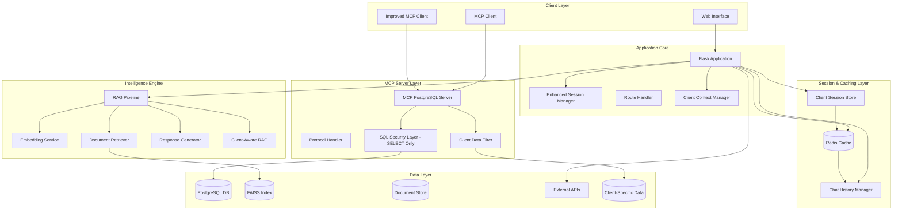

# Commission Dashboard Assistant with RAG, MCP PostgreSQL & Redis Integration 🚀

[](https://www.python.org/downloads/)
[](https://flask.palletsprojects.com/)
[](https://modelcontextprotocol.io/)
[](https://www.postgresql.org/)
[](https://redis.io/)
[](https://github.com/facebookresearch/faiss)
[](https://opensource.org/licenses/MIT)
[](https://github.com/psf/black)

## 🎯 Executive Summary

An enterprise-grade AI assistant for commission plan management, featuring state-of-the-art **Retrieval-Augmented Generation (RAG)** with **Model Context Protocol (MCP)** PostgreSQL server integration, **Redis-powered chat history management**, and **client-specific data retrieval**. This solution combines conversational AI, document intelligence, secure read-only database operations, persistent session management, and seamless API orchestration to revolutionize commission management workflows.

### 🔥 What's New in This Version
- **🔗 Client-Specific Data Retrieval**: Advanced filtering and data access based on client context and permissions
- **⚡ Redis Chat History**: Persistent conversation memory with configurable TTL (1 hour default)
- **🎯 Enhanced Session Management**: Improved user experience with conversation continuity across sessions
- **📊 Performance Optimized Caching**: Redis-based caching for faster response times and reduced database load
- **🔐 Enhanced Security**: Client-based data isolation and secure session handling
- **📈 Scalable Architecture**: Production-ready Redis integration for high-throughput applications

## 🌟 Core Features

### AI & Intelligence Layer
- **🤖 MCP PostgreSQL Integration**: Standards-compliant Model Context Protocol server for secure read-only database operations
- **📚 Advanced RAG System**: Hybrid retrieval with semantic understanding and document intelligence
- **🧠 Multi-Model Support**: Flexible LLM integration (OpenAI, Anthropic, local models)
- **💬 Persistent Chat Memory**: Redis-powered conversation history with configurable TTL and session persistence
- **🎯 Client-Aware Intelligence**: Context-aware responses based on client-specific data and permissions

### Commission Management
- **🎯 Guided Plan Creation**: Three-phase wizard with intelligent validation and client-specific templates
- **📊 Dynamic Rule Builder**: Complex commission structures with tiered calculations and client customization
- **🔄 Real-time API Integration**: Seamless backend synchronization with client-specific endpoints
- **📈 Business Logic Engine**: Support for multiple calculation types (Flat/Slab/Tiered) with client-specific rules
- **🏢 Multi-Client Support**: Isolated data access and customized workflows per client organization

### Database & Caching Layer
- **🔐 SQL Security Layer**: Protection against SQL injection with SELECT-only operations
- **🗄️ PostgreSQL Integration**: Secure read-only database operations through MCP protocol
- **📱 Redis Session Management**: High-performance chat history storage with automatic expiration
- **🔍 Intelligent Query Builder**: Safe and optimized SQL generation for client-specific data retrieval
- **📊 Real-time Analytics**: Client-specific insights and reporting capabilities with caching optimization

### Document Intelligence
- **📄 Multi-Format Processing**: PDF, DOCX, Excel, CSV, TXT, JSON, Images (OCR)
- **🔍 Semantic Search**: FAISS-powered vector similarity search with client-specific document filtering
- **⚡ Smart Chunking**: Adaptive document segmentation with client-aware indexing
- **🎨 Metadata Extraction**: Automatic document enrichment with client tagging and categorization

## 🏗️ System Architecture



## 📁 Project Structure

```
commission-dashboard-assistant-RAG/
│
├── 🎯 Core Application Files
│   ├── 📄 app.py                      # Main Flask application & route handlers with Redis integration
│   ├── 📄 rag.py                      # RAG pipeline implementation with client-aware filtering
│   └── 📄 requirements.txt            # Python dependencies (including redis-py)
│
├── 🤖 MCP Integration Files
│   ├── 📄 mcp_postgres_server.py      # MCP PostgreSQL server implementation (SELECT-only)
│   ├── 📄 mcp_client.py               # Standard MCP client
│   ├── 📄 improved_mcp_client.py      # Enhanced MCP client with logging and formatting
│   └── 📄 setup_mcp.py                # MCP configuration and setup script
│
├── 🗄️ Database & Caching Management
│   ├── 📄 final_db_utils.py          # Database utility functions with client filtering
│   ├── 📄 sql_security.py            # SQL injection protection & SELECT-only enforcement
│   ├── 📄 test_db.py                  # Database connection and query testing
│   ├── 📄 redis_manager.py           # Redis connection and session management (NEW)
│   └── 📄 client_data_manager.py     # Client-specific data retrieval and filtering (NEW)
│
├── 🎨 Frontend
│   └── 📁 templates/                  # HTML templates
│       └── index.html                 # Main web interface with session continuity
│
├── 📊 Data Storage
│   ├── 📁 data/                       # Document storage directory
│   │   ├── 📁 client-specific/        # Client-segregated document storage (NEW)
│   │   ├── 📄 README.md              # Data directory documentation
│   │   └── 📄 .gitkeep               # Git placeholder
│   └── 📁 model/                      # Model cache directory
│       ├── 📄 README.md              # Model directory documentation
│       └── 📄 .gitkeep               # Git placeholder
│
├── 📋 Configuration
│   ├── 📄 .env                        # Environment variables (not in repo)
│   ├── 📄 .gitignore                  # Git ignore rules
│   └── 📄 README.md                   # This file
```

## 🔧 Component Details

### Enhanced Core Application Files

#### `app.py` - Flask Application Core with Redis Integration
The main application server handling HTTP requests, Redis session management, and client-specific data orchestration.

**Key Functions:**
- `create_app()`: Application factory with Redis configuration and client context setup
- `initialize_redis()`: Redis connection initialization with session management
- `initialize_rag()`: RAG pipeline initialization with client-aware document indexing
- `chat()`: Enhanced chat endpoint with Redis-based conversation history and client filtering
- `get_chat_history()`: Retrieve persistent conversation history from Redis
- `save_chat_message()`: Store chat messages with TTL and client association
- `create_commission_plan()`: Multi-phase commission plan creation with client-specific workflows
- `handle_client_context()`: Client identification and context management
- `_test_api()`: Health check including Redis connectivity diagnostics

**New Features:**
- Redis-based session persistence with configurable TTL (default: 1 hour)
- Client-specific data filtering and access control
- Enhanced conversation continuity across browser sessions
- Automatic session cleanup and memory optimization
- Client context preservation and intelligent routing

#### `rag.py` - Enhanced RAG Pipeline with Client Awareness
Implements the Retrieval-Augmented Generation pipeline with client-specific document processing and filtering.

**Enhanced Classes:**
- `ClientAwareRAGPipeline`: Main orchestrator with client-specific document filtering
- `ClientDocumentLoader`: Multi-format document loading with client segregation
- `EnhancedTextSplitter`: Intelligent text chunking with client metadata embedding
- `ClientFilteredRetriever`: Vector search with client-specific result filtering
- `ContextAwareGenerator`: Response generation with client-specific templates and rules

**New Key Functions:**
- `load_client_documents()`: Load documents specific to client context
- `create_client_embeddings()`: Generate embeddings with client metadata
- `client_filtered_search()`: Semantic search with client access control
- `generate_client_response()`: Context-aware response generation with client customization
- `update_client_index()`: Incremental updates to client-specific vector indices

### New Redis & Client Management Files

#### `redis_manager.py` - Redis Session & Cache Management (NEW)
Comprehensive Redis integration for chat history, session management, and performance caching.

**Core Classes:**
- `RedisSessionManager`: Chat history persistence with TTL management
- `RedisCacheManager`: Query result caching and performance optimization
- `ClientSessionStore`: Client-specific session isolation and management

**Key Functions:**
- `store_chat_history()`: Save conversation messages with automatic expiration
- `retrieve_chat_history()`: Load conversation history with pagination support
- `manage_session_ttl()`: Dynamic TTL adjustment based on user activity
- `clear_expired_sessions()`: Automatic cleanup of expired conversation data
- `get_client_cache()`: Client-specific caching with isolation boundaries
- `invalidate_cache()`: Selective cache invalidation for real-time updates

**Configuration Options:**
- Configurable TTL for chat history (default: 3600 seconds / 1 hour)
- Redis connection pooling for high-performance applications
- Automatic failover and reconnection handling
- Memory optimization with LRU eviction policies

#### `client_data_manager.py` - Client-Specific Data Retrieval (NEW)
Advanced client data filtering and access control system for multi-tenant environments.

**Core Features:**
- `ClientDataFilter`: Implements client-specific data access rules
- `DataIsolationManager`: Ensures data privacy and client separation
- `ClientContextBuilder`: Dynamic context creation based on client identity
- `PermissionManager`: Role-based access control for client data

**Key Functions:**
- `filter_by_client()`: Apply client-specific filters to database queries
- `validate_client_access()`: Verify client permissions for data access
- `build_client_context()`: Create comprehensive client context for RAG operations
- `get_client_documents()`: Retrieve client-specific document collections
- `apply_data_governance()`: Enforce data governance and compliance rules

**Security Features:**
- Row-level security implementation for client data isolation
- Audit logging for all client data access
- Dynamic permission evaluation based on client roles
- Data masking for sensitive information protection

### Enhanced Database Management

#### Updated `final_db_utils.py` - Database Utilities with Client Support
Enhanced database utility functions with client-specific querying and advanced caching.

**Enhanced Functions:**
- `create_client_connection()`: Establish client-aware database connections
- `execute_client_query()`: Run queries with automatic client filtering
- `get_client_schema_info()`: Retrieve client-specific schema information
- `cache_query_results()`: Redis-based query result caching with client isolation

**New Client Features:**
- Client-specific connection pooling and optimization
- Automatic query result caching with Redis integration
- Dynamic query building with client context injection
- Performance monitoring and optimization for client queries

## 🚀 Installation & Setup

### Prerequisites
- Python 3.10+ 
- PostgreSQL 13+
- **Redis 7.0+** (NEW REQUIREMENT)
- Tesseract OCR (for image processing)
- 8GB+ RAM recommended
- Optional: CUDA-capable GPU for faster embeddings

### 1. Clone Repository
```bash
git clone https://github.com/SNEAKO7/commission-dashboard-assistant-RAG-.git
cd commission-dashboard-assistant-RAG-
```

### 2. Create Virtual Environment
```bash
# macOS/Linux
python3 -m venv .venv
source .venv/bin/activate

# Windows
python -m venv .venv
.venv\Scripts\activate
```

### 3. Install Dependencies
```bash
pip install -r requirements.txt
```

### 4. Redis Setup
```bash
# Install Redis
# Ubuntu/Debian
sudo apt-get install redis-server

# macOS
brew install redis

# Windows (using WSL or Docker recommended)
docker run -d -p 6379:6379 redis:7-alpine

# Start Redis server
redis-server

# Test Redis connection
redis-cli ping
```

### 5. PostgreSQL Setup
```bash
# Create database
createdb commission_dashboard

# Run setup script
python setup_mcp.py
```

### 6. Configure Environment
Create `.env` file:
```env
# Flask Configuration
FLASK_SECRET_KEY=your-super-secure-secret-key-here
FLASK_ENV=development
FLASK_DEBUG=True

# API Configuration
BACKEND_API_BASE_URL=https://localhost:8081
JWT_TOKEN=your-jwt-token-if-needed

# Database Configuration
DB_HOST=localhost
DB_PORT=5432
DB_NAME=commission_dashboard
DB_USER=your_db_user
DB_PASSWORD=your_db_password

# Redis Configuration (NEW)
REDIS_HOST=localhost
REDIS_PORT=6379
REDIS_PASSWORD=your_redis_password  # Optional, leave empty if no auth
REDIS_DB=0
REDIS_SSL=false
CHAT_HISTORY_TTL=3600  # 1 hour in seconds
REDIS_CONNECTION_POOL_SIZE=10

# MCP Configuration
MCP_SERVER_HOST=localhost
MCP_SERVER_PORT=5000
MCP_CLIENT_TIMEOUT=30

# RAG Configuration
DOCUMENTS_FOLDER=data
MODEL_CACHE_DIR=model
EMBEDDING_MODEL=sentence-transformers/all-MiniLM-L6-v2
CHUNK_SIZE=800
CHUNK_OVERLAP=100

# Client-Specific Configuration (NEW)
ENABLE_CLIENT_FILTERING=true
CLIENT_DATA_ISOLATION=strict
DEFAULT_CLIENT_ID=default
CLIENT_DOCUMENT_PATH=data/client-specific
```

### 7. Create Required Directories
```bash
# Create data and model directories if they don't exist
mkdir -p data model data/client-specific
```

### 8. Initialize Services
```bash
# Initialize Redis manager
python redis_manager.py --init

# Initialize client data manager  
python client_data_manager.py --setup

# Run database utilities to create tables
python final_db_utils.py

# Test all connections
python test_db.py && redis-cli ping
```

### 9. Add Documents with Client Organization
```bash
# Copy general documents to the main data folder
cp /path/to/your/documents/* data/

# Copy client-specific documents to segregated folders
mkdir -p data/client-specific/client1
mkdir -p data/client-specific/client2
cp /path/to/client1/documents/* data/client-specific/client1/
cp /path/to/client2/documents/* data/client-specific/client2/
```

### 10. Launch Application

#### Standard Mode with Redis
```bash
python app.py
```

#### With Full MCP and Redis Stack
```bash
# Terminal 1: Start Redis Server (if not running as service)
redis-server

# Terminal 2: Start MCP PostgreSQL Server
python mcp_postgres_server.py

# Terminal 3: Start Flask App with Redis Integration
python app.py
```

Access at: **http://localhost:5000**

## 🔌 Enhanced API Documentation

### Chat Endpoint with Redis History
```http
POST /chat
Content-Type: application/json

{
    "message": "create a new commission plan for client ABC",
    "user_id": "user-123",
    "client_id": "client-abc",  // NEW: Client identification
    "session_id": "optional-session-id",
    "load_history": true        // NEW: Load chat history from Redis
}
```

**Enhanced Response:**
```json
{
    "response": "I'll help you create a commission plan for Client ABC. Based on your client's previous configurations...",
    "sources": ["client-abc/policy.pdf", "client-abc/rates.xlsx"],
    "session_id": "generated-session-id",
    "client_id": "client-abc",
    "plan_phase": 1,
    "status": "success",
    "chat_history_loaded": true,
    "history_message_count": 5,
    "cache_hit": true           // NEW: Indicates if Redis cache was used
}
```

### Chat History Management (NEW)
```http
GET /chat/history/{session_id}
```

**Response:**
```json
{
    "session_id": "session-123",
    "client_id": "client-abc",
    "messages": [
        {
            "timestamp": "2025-01-15T10:30:00Z",
            "role": "user",
            "content": "What are our Q3 commission rates?",
            "client_context": "client-abc"
        },
        {
            "timestamp": "2025-01-15T10:30:15Z", 
            "role": "assistant",
            "content": "Based on your client-specific rates...",
            "sources": ["client-abc/q3-rates.pdf"]
        }
    ],
    "total_messages": 10,
    "ttl_remaining": 2847,      // Seconds until expiration
    "created_at": "2025-01-15T10:00:00Z"
}
```

### Client Data Access (NEW)
```http
GET /client/{client_id}/data
Authorization: Bearer {jwt_token}
```

**Response:**
```json
{
    "client_id": "client-abc",
    "accessible_documents": ["policy.pdf", "rates.xlsx", "guidelines.docx"],
    "commission_plans": [
        {
            "plan_id": "plan-123",
            "name": "Q3 Sales Incentives",
            "valid_from": "2025-07-01",
            "valid_to": "2025-09-30"
        }
    ],
    "client_context": {
        "region": "North America",
        "currency": "USD",
        "commission_model": "tiered"
    }
}
```

### Redis Cache Management (NEW)
```http
POST /cache/clear
Content-Type: application/json

{
    "scope": "client",          // Options: "global", "client", "session"
    "client_id": "client-abc",  // Required for client scope
    "session_id": "optional"    // Required for session scope
}
```

### Health Check with Redis Status
```http
GET /_test_api
```

**Enhanced Response:**
```json
{
    "api_base_url": "https://localhost:8081",
    "test_endpoint_status": 200,
    "jwt_present": true,
    "database_connected": true,
    "redis_connected": true,              // NEW
    "redis_memory_usage": "45.2MB",       // NEW  
    "active_sessions": 12,                // NEW
    "mcp_server_status": "healthy",
    "client_filtering_enabled": true,     // NEW
    "test_response": "OK"
}
```

## 📊 Enhanced Commission Plan Workflow with Client Context

### Phase 1: Plan Metadata with Client Information
```json
{
    "phase": 1,
    "client_id": "client-abc",              // NEW
    "fields": {
        "plan_name": "Q3 Sales Incentives - Client ABC",
        "description": "Quarterly sales commission structure for Client ABC",
        "calculation_schedule": "Monthly",
        "payment_schedule": "Monthly", 
        "assignee_type": "Territory",
        "valid_from": "2025-01-01",
        "valid_to": "2025-03-31",
        "client_specific_rules": {          // NEW
            "currency": "USD",
            "region": "North America",
            "compliance_level": "enterprise"
        }
    }
}
```

### Phase 2: Business Rules with Client Customization
```json
{
    "phase": 2,
    "client_id": "client-abc",
    "fields": {
        "plan_type": "Revenue Target",
        "category_type": "Tiered",
        "range_type": "Amount", 
        "value_type": "Percentage",
        "base_value": "Gross Revenue",
        "client_tier_overrides": {          // NEW
            "premium_threshold": 500000,
            "enterprise_multiplier": 1.2
        },
        "tiers": [
            {"from": 0, "to": 100000, "commission": 5},
            {"from": 100001, "to": 250000, "commission": 7},
            {"from": 250001, "to": null, "commission": 10}
        ]
    }
}
```

### Phase 3: Assignments & Submission with Client Context
```json
{
    "phase": 3,
    "client_id": "client-abc",
    "fields": {
        "assignments": [
            {
                "territory": "North", 
                "product": "Product A",
                "client_override": "priority_1"    // NEW
            },
            {
                "territory": "South", 
                "product": "Product B",
                "client_override": "standard"      // NEW
            }
        ],
        "currency": "USD",
        "uom": "Each",
        "client_approvals": {               // NEW
            "manager_approval": "required",
            "finance_review": "auto_approved",
            "compliance_check": "passed"
        }
    }
}
```

## 🎯 Enhanced Usage Examples

### Client-Specific Commission Plan Creation
```python
# User: "Create a new commission plan for our enterprise client in EMEA region"
# Assistant loads client context from Redis, applies EMEA-specific rules
# "I'll create a commission plan tailored for your EMEA enterprise client. 
#  Based on your client's tier (Enterprise) and region (EMEA), I'll apply 
#  the appropriate currency (EUR) and compliance requirements..."

# System automatically:
# 1. Identifies client from session context
# 2. Loads client-specific templates from Redis cache
# 3. Applies regional and tier-based customizations
# 4. Stores conversation in Redis with 1-hour TTL
```

### Persistent Conversation with History
```python
# Session 1 - User: "What are the commission rates for North Region?"
# Assistant: "For Client ABC, North Region rates are: 5% up to $100K, 7% from $100K-250K..."
# [Conversation stored in Redis with TTL]

# Session 2 (30 minutes later) - User: "Can you increase those rates by 1%?"
# Assistant: "I understand you want to increase the North Region rates we discussed 
#            earlier by 1%. This would change them from 5%/7%/10% to 6%/8%/11%..."
# [System loads previous context from Redis automatically]
```

### Client-Filtered Document Search
```python
# User: "Find information about Q4 performance bonuses"
# System searches only client-specific documents:
# - data/client-specific/client-abc/q4-bonuses.pdf
# - data/client-specific/client-abc/performance-metrics.xlsx
# 
# Response: "Based on your Q4 performance bonus documentation, Client ABC has 
#           a tiered bonus structure with performance multipliers..."
# Sources: [client-abc/q4-bonuses.pdf, client-abc/performance-metrics.xlsx]
```

### Redis-Cached Database Operations
```python
# First query - hits database, stores in Redis
client.execute_tool("query", {
    "sql": "SELECT * FROM commission_plans WHERE client_id = %s AND status = 'active'",
    "params": ["client-abc"]
})
# Response time: 150ms, Cache: MISS

# Subsequent identical query - served from Redis
client.execute_tool("query", {
    "sql": "SELECT * FROM commission_plans WHERE client_id = %s AND status = 'active'", 
    "params": ["client-abc"]
})
# Response time: 15ms, Cache: HIT
```

## ⚡ Enhanced Performance Optimization

### Redis Performance Features
- **Chat History Caching**: Instant conversation loading with Redis storage
- **Query Result Caching**: Database query results cached with configurable TTL
- **Session Management**: High-performance session storage with automatic cleanup
- **Connection Pooling**: Optimized Redis connection management for high concurrency

### Client-Specific Optimizations
- **Document Indexing**: Client-segregated FAISS indices for faster retrieval
- **Context Caching**: Client context and permissions cached for rapid access
- **Lazy Loading**: Client data loaded on-demand and cached for subsequent requests
- **Smart Invalidation**: Selective cache invalidation based on client data changes

### Scaling Recommendations for Enhanced Architecture
- **Redis Cluster**: Use Redis Cluster for horizontal scaling of cache layer
- **Read Replicas**: PostgreSQL read replicas with client-specific routing
- **CDN Integration**: Client document caching with geographic distribution
- **Load Balancing**: Session-aware load balancing with Redis session store
- **Microservices**: Extract client management into dedicated microservice
- **Message Queues**: Async processing for client data updates and notifications

## 🔧 Enhanced Troubleshooting

| Issue | Solution |
|-------|----------|
| **Redis Connection Failed** | Check Redis service status: `redis-cli ping`, verify REDIS_HOST and REDIS_PORT in `.env` |
| **Chat History Not Loading** | Verify TTL settings and Redis memory usage, check session_id format |
| **Client Data Not Filtering** | Ensure CLIENT_FILTERING_ENABLED=true and valid client_id in requests |
| **Session TTL Issues** | Adjust CHAT_HISTORY_TTL value, monitor Redis memory usage with `redis-cli info memory` |
| **High Redis Memory Usage** | Implement LRU eviction policy, monitor with `redis-cli memory usage {key}` |
| **Client Context Errors** | Verify client_id exists in database and client data manager configuration |
| **Cache Invalidation Problems** | Use selective cache clearing, check cache key patterns and expiration settings |
| **Performance Degradation** | Monitor Redis connection pool, enable connection persistence, check network latency |

## 🔐 Enhanced Security Best Practices

### Client Data Security
- **Data Isolation**: Strict client data separation with row-level security
- **Access Control**: Role-based permissions with client context validation
- **Audit Logging**: Comprehensive logging of all client data access
- **Encryption**: Redis data encryption in transit and at rest
- **Session Security**: Secure session tokens with automatic expiration

### Redis Security Configuration
```bash
# Redis security configuration
redis-cli CONFIG SET requirepass "your-secure-redis-password"
redis-cli CONFIG SET protected-mode yes
redis-cli CONFIG SET bind "127.0.0.1"

# Enable Redis SSL/TLS (production)
redis-server --tls-port 6380 --port 0 \
    --tls-cert-file redis.crt \
    --tls-key-file redis.key \
    --tls-ca-cert-file ca.crt
```

### Client Context Security
- **Context Validation**: Verify client context integrity on each request
- **Permission Caching**: Cache client permissions with short TTL for security
- **Data Masking**: Automatic PII masking for sensitive client information
- **Compliance Logging**: Track all client data access for regulatory compliance

## 🧪 Enhanced Testing

### Run Enhanced Tests
```bash
# Test database connectivity and client filtering
python test_db.py --test-clients

# Test Redis connectivity and session management
python redis_manager.py --test

# Test client data filtering and isolation
python client_data_manager.py --test

# Run comprehensive test suite
python -m pytest tests/ -v

# Test Redis chat history functionality
python -c "
from redis_manager import RedisSessionManager
redis_mgr = RedisSessionManager()
print('Redis Status:', redis_mgr.test_connection())
print('Chat History Test:', redis_mgr.test_chat_history())
"

# Test client-specific document retrieval
python -c "
from client_data_manager import ClientDataManager
client_mgr = ClientDataManager()
print('Client Filter Test:', client_mgr.test_client_filtering('client-abc'))
"
```
