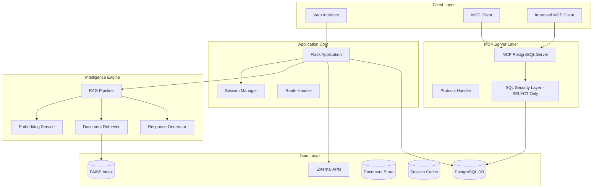

# Commission Dashboard Assistant with RAG & MCP PostgreSQL Integration 🚀

[](https://www.python.org/downloads/)
[](https://flask.palletsprojects.com/)
[](https://modelcontextprotocol.io/)
[](https://www.postgresql.org/)
[](https://github.com/facebookresearch/faiss)
[](https://opensource.org/licenses/MIT)
[](https://github.com/psf/black)

## 🎯 Executive Summary

An enterprise-grade AI assistant for commission plan management, featuring state-of-the-art **Retrieval-Augmented Generation (RAG)** with **Model Context Protocol (MCP)** PostgreSQL server integration. This solution combines conversational AI, document intelligence, secure read-only database operations, and seamless API orchestration to revolutionize commission management workflows.

### 🔥 What's New in This Version
- **MCP PostgreSQL Server**: Read-only MCP server with secure PostgreSQL database integration
- **Enhanced Security**: SQL injection protection and SELECT-only query handling
- **Dual MCP Clients**: Standard and improved clients for flexible integration
- **Database Utilities**: Comprehensive database querying and schema access tools
- **Production-Ready Architecture**: Enterprise-grade error handling, logging, and security

## 🌟 Core Features

### AI & Intelligence Layer
- **🤖 MCP PostgreSQL Integration**: Standards-compliant Model Context Protocol server for secure read-only database operations
- **📚 Advanced RAG System**: Hybrid retrieval with semantic understanding and document intelligence
- **🧠 Multi-Model Support**: Flexible LLM integration (OpenAI, Anthropic, local models)
- **💬 Conversational Memory**: Context-aware dialogue management with session persistence

### Commission Management
- **🎯 Guided Plan Creation**: Three-phase wizard with intelligent validation
- **📊 Dynamic Rule Builder**: Complex commission structures with tiered calculations
- **🔄 Real-time API Integration**: Seamless backend synchronization
- **📈 Business Logic Engine**: Support for multiple calculation types (Flat/Slab/Tiered)

### Database & Security
- **🔐 SQL Security Layer**: Protection against SQL injection with SELECT-only operations
- **🗄️ PostgreSQL Integration**: Secure read-only database operations through MCP protocol
- **🔍 Intelligent Query Builder**: Safe and optimized SQL generation for data retrieval
- **📊 Database Analytics**: Real-time insights and reporting capabilities

### Document Intelligence
- **📄 Multi-Format Processing**: PDF, DOCX, Excel, CSV, TXT, JSON, Images (OCR)
- **🔍 Semantic Search**: FAISS-powered vector similarity search
- **⚡ Smart Chunking**: Adaptive document segmentation
- **🎨 Metadata Extraction**: Automatic document enrichment

## 🏗️ System Architecture



## 📁 Project Structure

```
commission-dashboard-assistant-RAG/
│
├── 🎯 Core Application Files
│   ├── 📄 app.py                      # Main Flask application & route handlers
│   ├── 📄 rag.py                      # RAG pipeline implementation
│   └── 📄 requirements.txt            # Python dependencies
│
├── 🤖 MCP Integration Files
│   ├── 📄 mcp_postgres_server.py      # MCP PostgreSQL server implementation (SELECT-only)
│   ├── 📄 mcp_client.py               # Standard MCP client
│   ├── 📄 improved_mcp_client.py      # Enhanced MCP client with logging and formatting
│   └── 📄 setup_mcp.py                # MCP configuration and setup script
│
├── 🗄️ Database Management
│   ├── 📄 final_db_utils.py          # Database utility functions (querying & schema access)
│   ├── 📄 sql_security.py            # SQL injection protection & SELECT-only enforcement
│   └── 📄 test_db.py                  # Basic database connection and query testing
│
├── 🎨 Frontend
│   └── 📁 templates/                  # HTML templates
│       └── index.html                 # Main web interface
│
├── 📊 Data Storage (create if needed)
│   ├── 📁 data/                       # Document storage directory
│   │   ├── 📄 README.md              # Data directory documentation
│   │   └── 📄 .gitkeep               # Git placeholder
│   └── 📁 model/                      # Model cache directory (create if needed)
│       ├── 📄 README.md              # Model directory documentation
│       └── 📄 .gitkeep               # Git placeholder
│
├── 📋 Configuration
│   ├── 📄 .env                        # Environment variables (not in repo)
│   ├── 📄 .gitignore                  # Git ignore rules
│   └── 📄 README.md                   # This file
```

## 🔧 Component Details

### Core Application Files

#### `app.py` - Flask Application Core
The main application server handling HTTP requests and orchestrating the entire system.

**Key Functions:**
- `create_app()`: Application factory with configuration management
- `initialize_rag()`: RAG pipeline initialization with lazy loading
- `chat()`: Main chat endpoint with session management and conversation flow
- `create_commission_plan()`: Multi-phase commission plan creation workflow
- `handle_plan_creation()`: Orchestrates the three-phase plan creation process
- `_test_api()`: Health check and connectivity diagnostics
- `_clear_cache()`: Cache management and vector store reset

**Features:**
- Session-based conversation tracking with Flask-Session
- JWT authentication support for secure API calls
- CORS configuration for cross-origin requests
- Comprehensive error handling and logging
- Request/response validation
- Integration with PostgreSQL through MCP (read-only)

#### `rag.py` - RAG Pipeline Engine
Implements the Retrieval-Augmented Generation pipeline with advanced document processing.

**Core Classes:**
- `RAGPipeline`: Main orchestrator for document processing and retrieval
- `DocumentLoader`: Multi-format document loading and parsing
- `TextSplitter`: Intelligent text chunking with overlap
- `EmbeddingGenerator`: Vector embedding creation using HuggingFace models
- `FAISSIndex`: Vector store management with similarity search

**Key Functions:**
- `load_documents()`: Recursive document loading from data folder
- `process_documents()`: Document parsing for various formats (PDF, DOCX, Excel, etc.)
- `create_embeddings()`: Generate embeddings using sentence transformers
- `search()`: Semantic similarity search with FAISS
- `generate_response()`: Context-aware response generation
- `clear_cache()`: Reset vector store and reload documents

**Advanced Features:**
- Support for PDF, DOCX, Excel, CSV, TXT, JSON, and images (OCR)
- Adaptive chunking (800 chars with 100 overlap by default)
- Persistent FAISS index with incremental updates
- Source attribution and citation in responses

### MCP Integration Files

#### `mcp_postgres_server.py` - MCP PostgreSQL Server
Secure Model Context Protocol server with read-only PostgreSQL database integration.

**Architecture:**
- `MCPPostgreSQLServer`: Main server class handling MCP protocol
- `DatabaseConnection`: PostgreSQL connection management
- `QueryExecutor`: Safe SQL query execution (SELECT-only)
- `ResponseFormatter`: MCP-compliant response formatting

**Current Supported Operations:**
- `query`: Execute SELECT queries with result streaming
- `schema`: Retrieve database schema information

**Security Features:**
- SQL injection prevention through `sql_security.py`
- SELECT-only query enforcement (all modification operations blocked)
- Query validation and sanitization
- Connection pooling and management
- Audit logging for all operations

**Note**: Only SELECT queries are currently supported. INSERT, UPDATE, DELETE, and other modification operations are blocked by the security layer for safety.

#### `mcp_client.py` - Standard MCP Client
Basic MCP client for interacting with the PostgreSQL server.

**Core Functions:**
- `connect()`: Establish connection to MCP server
- `send_request()`: Send MCP protocol requests
- `receive_response()`: Handle server responses
- `execute_tool()`: Invoke MCP tools
- `close()`: Clean connection closure

**Features:**
- MCP protocol implementation
- Automatic reconnection on failure
- Request/response logging
- Error handling and retry logic

#### `improved_mcp_client.py` - Enhanced MCP Client
Enhanced MCP client with additional logging and response formatting.

**Current Features:**
- Enhanced logging and debugging capabilities
- Improved response formatting
- Better error handling and status reporting
- Synchronous operation support

**Planned Features:**
- **Async Operations**: Non-blocking database queries
- **Connection Pooling**: Efficient connection management
- **Batch Operations**: Execute multiple queries in one request
- **Streaming Results**: Handle large result sets efficiently
- **Caching Layer**: Query result caching for performance

#### `setup_mcp.py` - MCP Setup Script
Configuration and initialization script for MCP components.

**Setup Functions:**
- `check_prerequisites()`: Verify system requirements
- `install_dependencies()`: Install required packages
- `configure_mcp()`: Set up MCP configuration
- `initialize_database()`: Create necessary database tables
- `test_connection()`: Validate MCP server connectivity
- `generate_config()`: Create configuration files

**Configuration Options:**
- Server host and port settings
- Database connection parameters
- Security configurations
- Performance tuning options
- Logging levels and paths

### Database Management Files

#### `final_db_utils.py` - Database Utilities
Database utility functions focused on querying and schema access.

**Current Utility Functions:**
- `create_connection()`: Establish secure database connections
- `get_schema_info()`: Retrieve database schema information
- `safe_query_builder()`: Build safe SELECT queries
- `validate_table_access()`: Verify table access permissions

**Commission Plan Functions:**
- `retrieve_plan()`: Fetch plan details
- `search_plans()`: Query plans with filters
- `get_commission_data()`: Retrieve commission information
- `analyze_performance()`: Generate performance reports

**Planned Features:**
- Schema migrations and version management
- Database backup and restore utilities
- Data cleanup and maintenance tools
- Advanced optimization utilities

#### `sql_security.py` - SQL Security Layer
Comprehensive SQL injection protection and SELECT-only enforcement.

**Security Functions:**
- `validate_query()`: Check queries for malicious patterns and enforce SELECT-only
- `sanitize_input()`: Clean user inputs
- `escape_parameters()`: Proper parameter escaping
- `check_permissions()`: Verify user permissions
- `audit_query()`: Log all database operations
- `detect_anomalies()`: Identify suspicious patterns

**Protection Features:**
- Pattern-based SQL injection detection
- **SELECT-only query enforcement** (blocks INSERT/UPDATE/DELETE/DROP)
- Input validation and sanitization
- Query complexity limits
- Rate limiting for database operations
- Audit trail for compliance

#### `test_db.py` - Database Testing
Basic database connection and query testing.

**Current Test Coverage:**
- `test_connection()`: Verify database connectivity
- `test_environment()`: Validate environment variable loading
- `test_basic_query()`: Test simple SELECT queries on plan_master table

**Planned Test Expansion:**
- Comprehensive CRUD operation tests
- Security vulnerability testing
- Performance benchmarking
- Load testing capabilities
- MCP integration testing

### Frontend Files

#### `templates/index.html` - Web Interface
Clean, functional web interface for the commission dashboard assistant.

**Current UI Components:**
- **Chat Interface**: Form-based conversation with AI assistant
- **Plan Creation Forms**: Multi-phase guided workflow
- **Document Upload**: File management interface
- **Results Display**: Formatted responses with basic styling

**Current Features:**
- Form-based interaction with Flask backend
- Session-based state management
- Basic responsive design
- File upload capabilities

**Planned Features:**
- WebSocket support for real-time updates
- Dynamic form validation
- Real-time notifications
- Advanced JavaScript interactions
- Mobile-responsive enhancements

## 🚀 Installation & Setup

### Prerequisites
- Python 3.10+ 
- PostgreSQL 13+
- Tesseract OCR (for image processing)
- 8GB+ RAM recommended
- Optional: CUDA-capable GPU for faster embeddings

### 1. Clone Repository
```bash
git clone https://github.com/SNEAKO7/commission-dashboard-assistant-RAG-.git
cd commission-dashboard-assistant-RAG-
```

### 2. Create Virtual Environment
```bash
# macOS/Linux
python3 -m venv .venv
source .venv/bin/activate

# Windows
python -m venv .venv
.venv\Scripts\activate
```

### 3. Install Dependencies
```bash
pip install -r requirements.txt
```

### 4. PostgreSQL Setup
```bash
# Create database
createdb commission_dashboard

# Run setup script
python setup_mcp.py
```

### 5. Configure Environment
Create `.env` file:
```env
# Flask Configuration
FLASK_SECRET_KEY=your-super-secure-secret-key-here
FLASK_ENV=development
FLASK_DEBUG=True

# API Configuration
BACKEND_API_BASE_URL=https://localhost:8081
JWT_TOKEN=your-jwt-token-if-needed

# Database Configuration
DB_HOST=localhost
DB_PORT=5432
DB_NAME=commission_dashboard
DB_USER=your_db_user
DB_PASSWORD=your_db_password

# MCP Configuration
MCP_SERVER_HOST=localhost
MCP_SERVER_PORT=5000
MCP_CLIENT_TIMEOUT=30

# RAG Configuration
DOCUMENTS_FOLDER=data
MODEL_CACHE_DIR=model
EMBEDDING_MODEL=sentence-transformers/all-MiniLM-L6-v2
CHUNK_SIZE=800
CHUNK_OVERLAP=100
```

### 6. Create Required Directories
```bash
# Create data and model directories if they don't exist
mkdir -p data model
```

### 7. Initialize Database
```bash
# Run database utilities to create tables
python final_db_utils.py

# Test database connection
python test_db.py
```

### 8. Add Documents
```bash
# Copy your documents to the data folder
cp /path/to/your/documents/* data/
```

### 9. Launch Application

#### Standard Mode
```bash
python app.py
```

#### With MCP Server
```bash
# Terminal 1: Start MCP PostgreSQL Server
python mcp_postgres_server.py

# Terminal 2: Start Flask App
python app.py
```

Access at: **http://localhost:5000**

## 🔌 API Documentation

### Chat Endpoint
```http
POST /chat
Content-Type: application/json

{
    "message": "create a new commission plan",
    "user_id": "optional-user-id",
    "session_id": "optional-session-id"
}
```

**Response:**
```json
{
    "response": "I'll help you create a commission plan. Let's start with the basic details...",
    "sources": ["document1.pdf", "document2.docx"],
    "session_id": "generated-session-id",
    "plan_phase": 1,
    "status": "success"
}
```

**Note**: The `"sources"` field is included only when the RAG pipeline finds relevant supporting documents; otherwise it may be omitted.

### Health Check
```http
GET /_test_api
```

**Response:**
```json
{
    "api_base_url": "https://localhost:8081",
    "test_endpoint_status": 200,
    "jwt_present": true,
    "database_connected": true,
    "mcp_server_status": "healthy",
    "test_response": "OK"
}
```

### Cache Management
```http
POST /_clear_cache
```

### MCP Database Query
```python
# Using standard client - Only SELECT queries supported
from mcp_client import MCPClient

client = MCPClient("localhost", 5000)
result = client.execute_tool("query", {
    "sql": "SELECT * FROM commission_plans WHERE region = %s",
    "params": ["North"]
})

# Note: Only SELECT queries are allowed. 
# INSERT/UPDATE/DELETE queries will be rejected by the security layer.
```

## 📊 Commission Plan Workflow

### Phase 1: Plan Metadata
```json
{
    "phase": 1,
    "fields": {
        "plan_name": "Q3 Sales Incentives",
        "description": "Quarterly sales commission structure",
        "calculation_schedule": "Monthly",
        "payment_schedule": "Monthly",
        "assignee_type": "Territory",
        "valid_from": "2025-01-01",
        "valid_to": "2025-03-31"
    }
}
```

### Phase 2: Business Rules
```json
{
    "phase": 2,
    "fields": {
        "plan_type": "Revenue Target",
        "category_type": "Tiered",
        "range_type": "Amount",
        "value_type": "Percentage",
        "base_value": "Gross Revenue",
        "tiers": [
            {"from": 0, "to": 100000, "commission": 5},
            {"from": 100001, "to": 250000, "commission": 7},
            {"from": 250001, "to": null, "commission": 10}
        ]
    }
}
```

### Phase 3: Assignments & Submission
```json
{
    "phase": 3,
    "fields": {
        "assignments": [
            {"territory": "North", "product": "Product A"},
            {"territory": "South", "product": "Product B"}
        ],
        "currency": "USD",
        "uom": "Each"
    }
}
```

## 🎯 Usage Examples

### Creating a Commission Plan via Chat
```python
# User: "Create a new commission plan for Q3 sales"
# Assistant: "I'll help you create a commission plan. Let's start with Phase 1..."
# The assistant guides through all three phases
```

### RAG Document Search
```python
# User: "What are the commission rates for North Region?"
# System searches documents and database, returns:
# "Based on the documents and database records, North Region has:
#  - 5% for sales up to $100,000
#  - 7% for sales between $100,001-$250,000
#  Sources: [commission_policy.pdf, database: commission_plans table]"
```

### Database Operations via MCP
```python
# Query commission plans (SELECT only)
client.execute_tool("query", {
    "sql": "SELECT * FROM commission_plans WHERE status = 'active'"
})

# Note: Modification queries are not supported
# The following would be BLOCKED by the security layer:
# client.execute_tool("execute", {
#     "sql": "UPDATE commission_plans SET status = %s WHERE id = %s",
#     "params": ["inactive", 123]
# })
```

## ⚡ Performance Optimization

### Database Optimization
- **Connection Pooling**: Reuse database connections
- **Query Optimization**: Indexed columns for fast retrieval
- **Read-Only Operations**: Optimized for SELECT queries only
- **Caching**: Query result caching for repeated queries

### RAG Optimization
- **Chunking Strategy**: 800 chars with 100 overlap (configurable)
- **Batch Processing**: Process documents in parallel
- **Vector Caching**: Persistent FAISS index
- **GPU Acceleration**: Optional CUDA support for embeddings

### Scaling Recommendations
- Use PostgreSQL read replicas for query distribution
- Implement Redis for session and query caching
- Consider Kubernetes for horizontal scaling
- Use message queues for async processing

## 🔧 Troubleshooting

| Issue | Solution |
|-------|----------|
| **Database Connection Failed** | Check PostgreSQL service and credentials in `.env` |
| **MCP Server Not Responding** | Verify MCP server is running and port is correct |
| **No RAG Results** | Ensure documents exist in `data/` folder; rebuild index |
| **SQL Security Error** | Query may contain restricted patterns or non-SELECT operations; check `sql_security.py` logs |
| **High Memory Usage** | Reduce `CHUNK_SIZE` or use smaller embedding model |
| **Slow Database Queries** | Run `ANALYZE` on tables; check indexes |
| **Modification Query Blocked** | Only SELECT queries are allowed; use external API for data modifications |

## 🔐 Security Best Practices

- **SQL Injection Protection**: All queries validated by `sql_security.py`
- **SELECT-Only Operations**: Database modifications blocked for security
- **Input Sanitization**: User inputs cleaned before processing
- **JWT Authentication**: Secure API endpoints with tokens
- **Database Encryption**: Use SSL/TLS for database connections
- **Audit Logging**: All operations logged for compliance
- **Rate Limiting**: Prevent abuse with request limits
- **Environment Variables**: Never commit `.env` file

## 🧪 Testing

### Run Current Tests
```bash
# Test database connectivity and basic SELECT queries
python test_db.py
```

### Test Coverage
Current testing includes:
- Database connection validation
- Environment variable loading
- Basic SELECT query execution on plan_master table

### Planned Test Expansion
- Comprehensive unit test suite with pytest
- Security vulnerability testing
- Performance benchmarking
- Load testing with locust
- MCP server integration tests

## 🗺️ Roadmap

### Completed ✅
- [x] MCP PostgreSQL Server Integration (SELECT-only)
- [x] Enhanced RAG Pipeline
- [x] SQL Security Layer with SELECT-only enforcement
- [x] Database Query Utilities
- [x] Dual MCP Clients (Standard & Improved with logging)

### In Progress 🚧
- [ ] Comprehensive Test Suite
- [ ] Advanced Database Utilities (migrations, backups)
- [ ] Enhanced MCP Client Features (async, streaming)

### Planned 📋
- [ ] WebSocket Support for Real-time Updates
- [ ] GraphRAG Implementation
- [ ] Advanced Analytics Dashboard
- [ ] Multi-tenant Architecture
- [ ] Voice Interface Support
- [ ] Mobile Application
- [ ] Kubernetes Deployment
- [ ] AI Model Fine-tuning Pipeline
- [ ] Advanced Caching with Redis
- [ ] Elasticsearch Integration
- [ ] API Rate Limiting & Throttling
- [ ] Full CRUD Support via Secure API Layer

## 🤝 Contributing

We welcome contributions! Please follow these guidelines:

1. Fork the repository
2. Create your feature branch (`git checkout -b feature/AmazingFeature`)
3. Write tests for new functionality
4. Ensure all tests pass (`python test_db.py`)
5. Commit your changes (`git commit -m 'Add AmazingFeature'`)
6. Push to the branch (`git push origin feature/AmazingFeature`)
7. Open a Pull Request

### Development Setup
```bash
# Install development dependencies
pip install -r requirements-dev.txt

# Run code formatting
black .

# Run linting
flake8 .

# Run type checking
mypy .
```

## 📄 License

This project is licensed under the MIT License - see the [LICENSE](LICENSE) file for details.

## 🙏 Acknowledgments

- **[FAISS](https://github.com/facebookresearch/faiss)** - Efficient similarity search
- **[Hugging Face](https://huggingface.co/)** - Transformer models and embeddings
- **[LangChain](https://langchain.com/)** - LLM application framework
- **[Model Context Protocol](https://modelcontextprotocol.io/)** - Standardized AI tool communication
- **[PostgreSQL](https://www.postgresql.org/)** - Robust relational database
- **[Flask](https://flask.palletsprojects.com/)** - Lightweight web framework
- **[Tesseract OCR](https://github.com/tesseract-ocr/tesseract)** - Optical character recognition
- The open-source AI/ML community

## 📧 Contact & Support

**Developer**: SNEAKO7  
**GitHub**: [@SNEAKO7](https://github.com/SNEAKO7)  
**Project Link**: [https://github.com/SNEAKO7/commission-dashboard-assistant-RAG-](https://github.com/SNEAKO7/commission-dashboard-assistant-RAG-)

### Getting Help
- 📖 Check the [Wiki](https://github.com/SNEAKO7/commission-dashboard-assistant-RAG-/wiki) for detailed guides
- 🐛 Report bugs via [GitHub Issues](https://github.com/SNEAKO7/commission-dashboard-assistant-RAG-/issues)
- 💬 Join discussions in [GitHub Discussions](https://github.com/SNEAKO7/commission-dashboard-assistant-RAG-/discussions)
- ⭐ Star the repository to show support!

---

<div align="center">
  <p><strong>Built with ❤️ for intelligent commission management</strong></p>
  <p>Powered by AI, RAG, and MCP Technologies</p>
  <p>⭐ Star us on GitHub — it motivates us a lot!</p>
</div>
